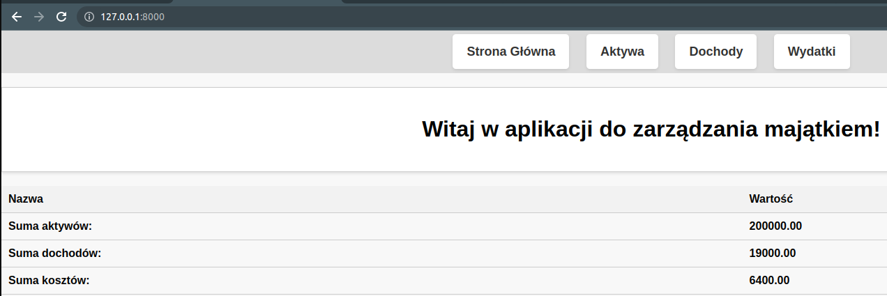
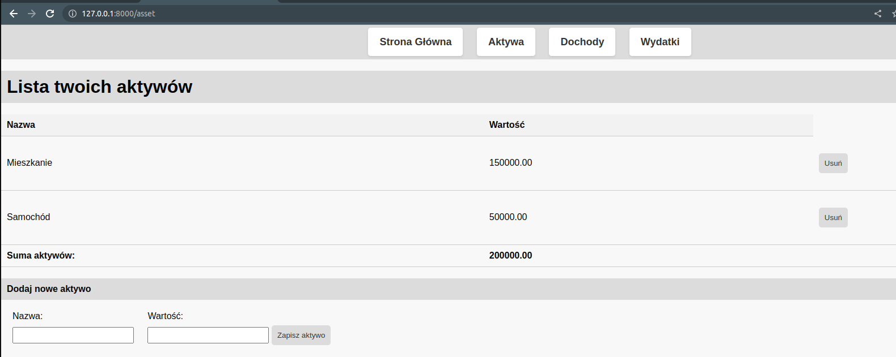
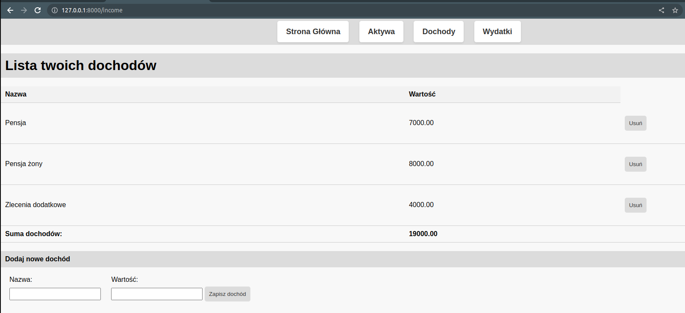
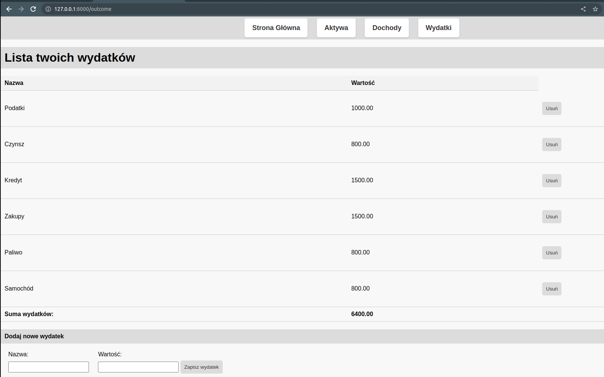

```
cd simple-django-app/cool_counters
```

Run migrations to update/create database
```
python3 manage.py makemigrations
python3 manage.py migrate
```

Run the Django development server
```
python3 manage.py runserver
```

Navigate to to http://127.0.0.1:8000


Screenshots

Strona główna:

Aktywa:

Dochody:

Wydatki:

